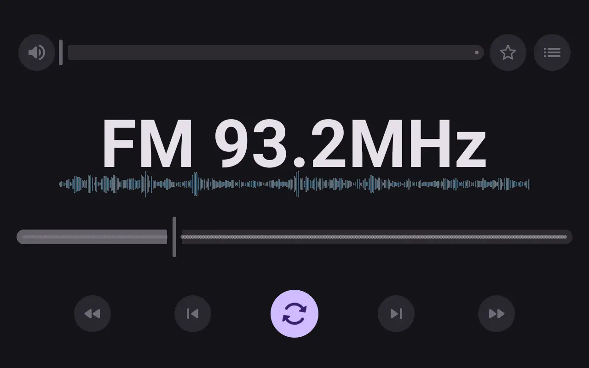

# 📻 RDA FM Radio 示例程序（Android）

这是一个运行于 Android 平台的 FM 收音机示例应用，专为搭载 RDA5807 或兼容芯片的设备设计。应用使用 JNI 或直接访问系统底层接口，控制 FM 调频广播模块的启用、调频、搜索、音量调节与收藏等功能。

界面采用极简的 **Material You** 风格，支持动态色彩、深色模式与系统无障碍特性，交互流畅，适合嵌入式设备、定制 ROM、便携式广播终端等场景使用或参考。

---

## ✨ 功能亮点

- ✅ 打开 / 关闭 FM 模块
- 🎚️ 调频
- 🔍 扫描电台
- 🔊 音量控制
- ⭐ 收藏喜爱频道

---

## 🛠️ 环境要求

- 📱 Android 6.0 及以上
- 🔓 已 root 或具备访问 `/dev/RDAFM` 等设备节点的权限
- 📡 搭载 RDA5807 或兼容 FM 接收芯片
- 🧩 系统支持 JNI / HAL 层访问

---

## 📷 应用截图

   
   
   

   
   
   

   
   
   

   
   
   

---

## 📥 安装方式

1. 前往 [Releases 页面](https://github.com/halifox/rdafm/releases) 下载最新版安装包
2. 按照系统提示进行安装，无需联网即可使用。

---

## 📜 许可证

本项目遵循 [GPL-3.0 License](LICENSE)。

---

## ⚠️ 法律声明

本开源项目仅供**个人技术学习与参考**。由于可能涉及专利或版权相关内容，请在使用前充分了解相关法律法规。未经授权，**禁止用于商业用途或任何形式的传播与分发**。

任何由使用本项目引发的法律责任，由使用者自行承担。